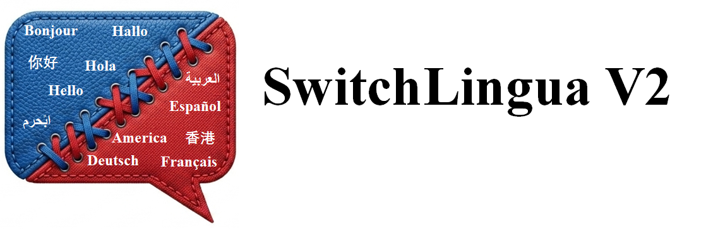

<p align="center">
  
</p>

<h1 align="center">SwitchLingua 2.0</h1>

<p align="center">
  <strong>A Theory-Grounded Multi-Stage Pipeline for Generating Naturalistic Code-Switching Dialogue and Speech Data</strong>
</p>

<p align="center">
  <a href="#overview">Overview</a> •
  <a href="#pipeline">Pipeline</a> •
  <a href="#supported-languages">Languages</a> •
  <a href="#quick-start">Quick Start</a> •
  <a href="#baselines">Baselines</a> •
  <a href="#citation">Citation</a>
</p>

---

## Overview

SwitchLingua 2.0 is a comprehensive framework for generating high-quality, naturalistic **code-switching (CS) dialogue data** and synthesizing the corresponding **speech**. It addresses the scarcity of CS training data by combining linguistic theory, persona-driven generation, and multi-stage quality control.

Key features:

- **Theory-grounded CS archetypes** based on Muysken (2000), Myers-Scotton (1993), Giles (1991) CAT, and other established frameworks
- **Persona-driven dialogue generation** with contextual parameter sampling for realistic speaker profiles
- **Real-time topic information injection** via news, academic, and knowledge APIs
- **Multi-layer quality evaluation**: rule-based evaluators (Stage 1) + LLM-based evaluators (Stage 1.5)
- **Speech synthesis pipeline** (Stage 2) with voice profile matching and multi-speaker TTS
- **16 language pairs** supported out of the box

## Pipeline

```
┌─────────────────────────────────────────────────────────────────────┐
│                        Stage 1: Text Generation                     │
│                                                                     │
│  ┌──────────────┐   ┌───────────────┐   ┌────────────────────────┐ │
│  │ Infrastructure │──▶│   Sampling    │──▶│  Dialogue Generator   │ │
│  │  • Archetypes  │   │  • Personas   │   │  • Speaker Agents ×2  │ │
│  │  • Backgrounds │   │  • Topics     │   │  • Accommodation Ctrl │ │
│  │  • Calibration │   │  • Relations  │   │  • Rule-Based Eval    │ │
│  └──────────────┘   └───────────────┘   └────────────────────────┘ │
└─────────────────────────────────────────────────────────────────────┘
                                │
                                ▼
┌─────────────────────────────────────────────────────────────────────┐
│                  Stage 1.5: LLM-Based Evaluation                    │
│                                                                     │
│   4 Evaluator Agents (Fluency, Naturalness, SocioCulture, Pattern)  │
│   + 1 Summary Agent  →  Quality filtering & scoring                 │
└─────────────────────────────────────────────────────────────────────┘
                                │
                                ▼
┌─────────────────────────────────────────────────────────────────────┐
│                    Stage 2: Speech Synthesis                        │
│                                                                     │
│   Voice Assignment  →  TTS Synthesis  →  Audio Assembly             │
│   (age/gender/accent matching)    (Fish Speech / CosyVoice)        │
└─────────────────────────────────────────────────────────────────────┘
```

## Supported Languages

All language pairs are `X ↔ English`:

| Language | Config | Language | Config |
|----------|--------|----------|--------|
| Chinese Mandarin (zh) | `zh_en` | Korean (ko) | `ko_en` |
| Cantonese (yue) | `yue_en` | Arabic (ar) | `ar_en` |
| Japanese (ja) | `ja_en` | Russian (ru) | `ru_en` |
| Malay (ms) | `ms_en` | Turkish (tr) | `tr_en` |
| Minangkabau (min) | `min_en` | Thai (th) | `th_en` |
| Hindi (hi) | `hi_en` | Italian (it) | `it_en` |
| Spanish (es) | `es_en` | French (fr) | `fr_en` |
| German (de) | `de_en` | | |

## Project Structure

```
SwitchLingua2.0/
├── stage1_infrastructure/     # Theoretical foundations & data structures
│   ├── archetypes.yaml        # 10 CS behavior archetypes
│   ├── background_pools.yaml  # Speaker background pools
│   ├── sampling.py            # Contextual parameter sampler
│   ├── prompt_generator.py    # Prompt template engine
│   ├── evaluator_agents.py    # Rule-based evaluator pipeline
│   └── language_config.py     # Language pair configuration
│
├── stage1_generate/           # Dialogue generation engine
│   ├── dialogue_generator.py  # Main generator with dual speaker agents
│   ├── topic_information.py   # Real-time topic info injection (MCP)
│   └── provider_config.yaml   # LLM provider configuration
│
├── stage1.5/                  # Post-generation LLM evaluation
│   ├── llm_evaluator.py       # 4+1 agent evaluation framework
│   ├── auto_metrics.py        # Automatic descriptive metrics (CMI, etc.)
│   └── analyze_results.py     # Evaluation result analysis
│
├── stage2/                    # Speech synthesis pipeline
│   ├── pipeline.py            # Main synthesis pipeline
│   ├── voice_assigner.py      # Voice profile matching
│   ├── tts_synthesizer.py     # TTS engine wrapper
│   ├── audio_assembler.py     # Multi-turn audio assembly
│   ├── batch_synthesize.py    # Batch processing script
│   └── voice_profiles/       # Voice profile definitions
│
├── configs/                   # Language-pair-specific configurations
│   └── {lang}_en/             # Prompts, personas, evaluation rules
│
├── baselines/                 # 8 baseline implementations + ablations
│   ├── naive_prompting.py     # Simple prompting baseline
│   ├── template_based.py      # Pratapa et al. (2018)
│   ├── unicom_swords.py       # UniCoM/SWORDS (EMNLP 2025)
│   ├── ezswitch_style.py      # EZSwitch (Kuwanto et al. 2024)
│   ├── fewshot_prompting.py   # Few-shot (Yong et al. 2023)
│   ├── mce_madgf.py           # MCE/MADGF (ICASSP 2025)
│   ├── switchlingua1.py       # SwitchLingua 1.0 (NeurIPS 2025)
│   └── ablation_*.py          # Ablation studies
│
├── stage2_offline/            # Offline TTS (direct model loading)
└── superpod/                  # HPC/SLURM deployment scripts
```

## Quick Start

### Prerequisites

- Python 3.10+
- A running vLLM server (for dialogue generation)
- PyYAML, requests

### Stage 1: Generate CS Dialogues

```bash
# 1. Start a vLLM server with your preferred model
# 2. Run the generator
python stage1_generate/dialogue_generator.py \
    --num-dialogues 100 \
    --turns-per-dialogue 6 \
    --api-base http://localhost:8001/v1 \
    --model Qwen3.5-122B-A10B-FP8 \
    --lang-pair zh_en \
    --output output/zh_en_dialogues.jsonl
```

### Stage 1.5: Quality Evaluation

```bash
# LLM-based evaluation (samples 10% by default)
python stage1.5/llm_evaluator.py \
    --input output/zh_en_dialogues.jsonl \
    --output output/stage1.5/zh_en_eval.jsonl \
    --api-base http://localhost:8001/v1 \
    --model Qwen3.5-122B-A10B-FP8 \
    --lang-pair zh_en

# Compute automatic metrics
python stage1.5/auto_metrics.py \
    --input output/zh_en_dialogues.jsonl \
    --report output/metrics/zh_en_metrics.md
```

### Stage 2: Speech Synthesis

```bash
# Option A: API-based (requires running Fish Speech / CosyVoice server)
python stage2/pipeline.py \
    --input output/zh_en_dialogues.jsonl \
    --output output/stage2/zh_en/ \
    --fish-url http://localhost:8080 \
    --profiles stage2/voice_profiles/profiles.yaml

# Option B: Offline (direct model loading, no server needed)
python stage2_offline/synthesize.py \
    --input output/zh_en_dialogues.jsonl \
    --output output/stage2/zh_en/ \
    --asset-dir stage2_offline/asset \
    --model-dir ~/models/s2-pro
```

## Baselines

Run all 8 baselines for comparison:

```bash
bash baselines/run_all.sh \
    --api-base http://localhost:8001/v1 \
    --model Qwen3.5-122B-A10B-FP8 \
    --lang-pair zh_en \
    --num 200
```

| # | Baseline | Reference |
|---|----------|-----------|
| 1 | Naive Prompting | — |
| 2 | Template-Based | Pratapa et al. (2018) |
| 3 | UniCoM/SWORDS | EMNLP 2025 |
| 4 | EZSwitch | Kuwanto et al. (2024) |
| 5 | Few-Shot Prompting | Yong et al. (2023) |
| 6 | MCE/MADGF | ICASSP 2025 |
| 7 | SwitchLingua 1.0 | NeurIPS 2025 |
| 8 | Persona-Only | Ablation |

## Adding a New Language Pair

1. Create a config directory: `configs/{lang}_en/`
2. Define the required YAML files (see `configs/zh_en/` as template):
   - `language.yaml` — language metadata and L1/L2 names
   - `prompts.yaml` — archetype-specific prompt templates
   - `personas.yaml` — speaker persona definitions
   - `evaluation.yaml` — language-specific evaluation rules
   - `calibration.json` — CMI calibration from reference corpus
3. Run the generator with `--lang-pair {lang}_en`

## Citation

```bibtex
@inproceedings{switchlingua2,
  title     = {SwitchLingua 2.0: A Theory-Grounded Pipeline for Generating Naturalistic Code-Switching Data},
  author    = {Xie, Peng},
  year      = {2025}
}
```

## License

This project is released for research purposes. Please cite the paper if you use it in your work.
